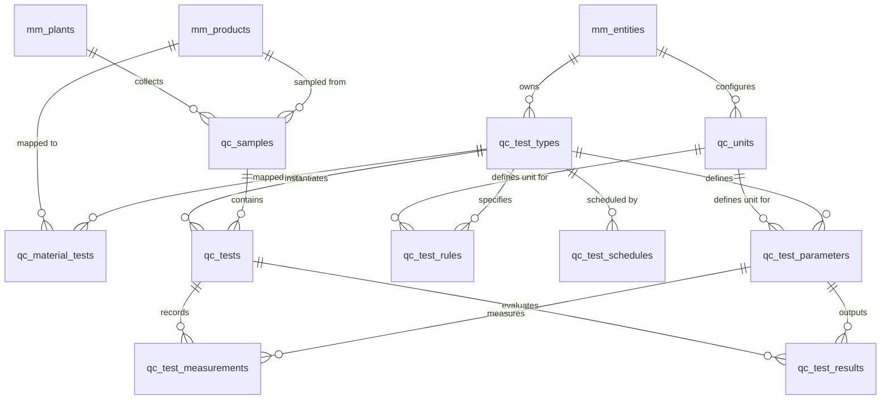
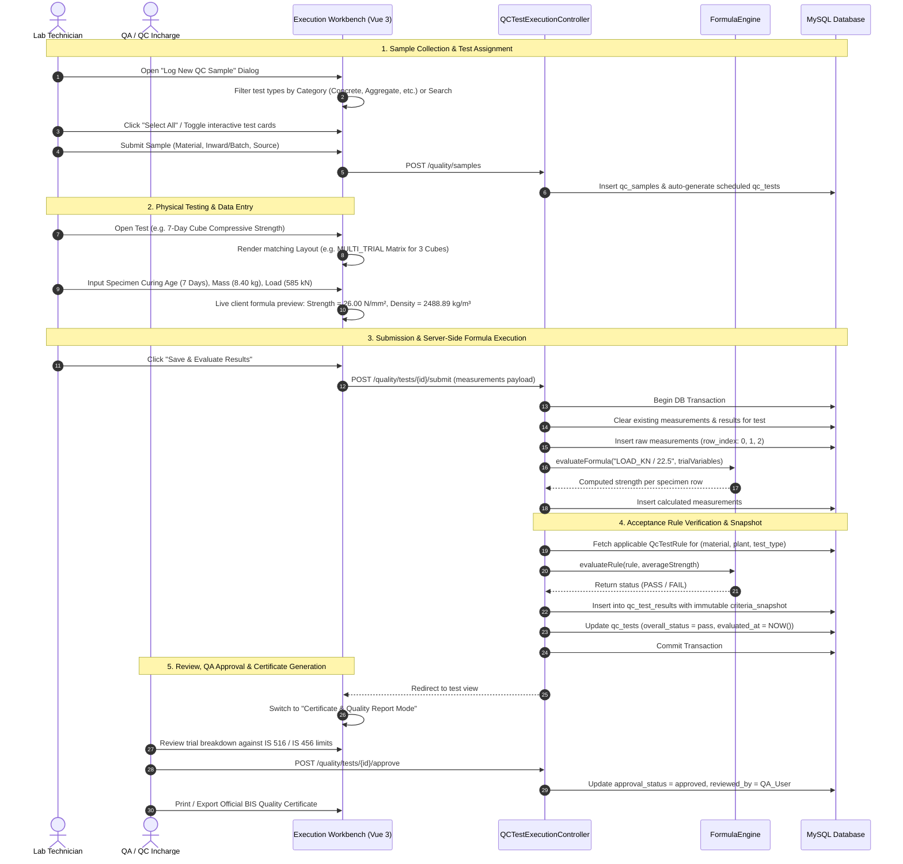

# Ready-Mix Concrete (RMC) Quality Control System Architecture & Technical Documentation

---

## 1. Executive Summary & Domain Scope

The **Quality Control (QC) & Quality Assurance (QA) System** in the ModorMC RMC Portal provides automated, standard-compliant management of laboratory testing, physical measurement evaluations, and quality verification across all stages of Ready-Mix Concrete manufacturing and material supply chains:

1. **Raw Material Inspection & Inward Quality Verification**:
   - **Coarse Aggregates**: 20mm, 10mm, 40mm crushed stone (Sieve Gradation, Flakiness & Elongation Index, Aggregate Impact Value, Crushing Value, Surface Moisture, Water Absorption, Bulk Density).
   - **Fine Aggregates**: Manufactured Sand (M-Sand), River Sand, Plastering Sand (Sieve Gradation, Fineness Modulus, Silt Content, Moisture).
   - **Cementitious Binders**: Ordinary Portland Cement (OPC 43/53), Portland Pozzolana Cement (PPC), Fly Ash (Class F/C), Ground Granulated Blast-furnace Slag (GGBS), Micro Silica (Standard Consistency, Initial & Final Setting Times, Soundness, Fineness).
   - **Batching Water**: Chemical suitability, pH, Chlorides, Sulfates, Total Dissolved Solids (TDS).
   - **Chemical Admixtures**: Polycarboxylate Ether (PCE) Superplasticizers, Retarders, Accelerators (Specific Gravity, Dry Solid Content, pH).
2. **Fresh Concrete Quality Control**:
   - Workability (Slump Cone Test at Plant & Site discharge), Pouring Concrete Temperature, Wet Bulk Density, Air Content, and Homogeneity / Bleeding / Segregation visual inspection.
3. **Hardened Concrete Performance Testing**:
   - Dedicated **7-Day Cube Compressive Strength (`CUBE_STRENGTH_7D`)** testing (65–70% target verification).
   - Dedicated **28-Day Cube Compressive Strength (`CUBE_STRENGTH_28D`)** testing with statistical compliance ($\ge f_{ck} + 1.65\sigma$), specimen density verification, and multi-specimen failure load matrices.
4. **Dynamic Units of Measurement (`qc_units`)**:
   - Universal & company-scoped physical units (`g`, `kg`, `mm`, `N/mm²`, `MPa`, `kN`, `%`, `°C`, `kg/m³`, `Litre`, `Minutes`, `Days`, `ppm`, `g/cc`) stored in the database and bound to parameters, tolerances, execution forms, and certificates.
5. **Regulatory & BIS Standard Alignment**:
   - Compliant with **IS 456:2000**, **IS 516 (Parts 1–4)**, **IS 1199 (Parts 1–7)**, **IS 2386 (Parts 1–5)**, **IS 383:2016**, **IS 4031 (Parts 1–6)**, **IS 269:2015**, **IS 9103:1999**, and **IS 3025**.
6. **Product Type Classification**:
   - Material catalog supports `'Quality Test'` product types via `Dropdown::ProductTypesDropdown()` alongside `'Inventory'`, `'Service'`, `'Purchase'`, and `'Sales'` to manage dedicated laboratory testing items, test charges, and calibration reference materials.

---

## 2. Database Schema & Affected Tables

The Quality Control subsystem consists of **10 normalized relational database tables** providing end-to-end traceability from dynamic engineering units to final test certificate generation.

---

### Table 1: `qc_units` (Dynamic Units of Measurement Master)
Stores the physical measurement units, dimensions, and symbols used across parameters, acceptance criteria, test execution grids, and reports.

| Column | Type | Description |
|---|---|---|
| `id` | `BIGINT UNSIGNED (PK)` | Primary key |
| `company_id` | `BIGINT UNSIGNED (FK, Nullable)` | Optional entity override (`NULL` for universal global units) |
| `plant_id` | `BIGINT UNSIGNED (FK, Nullable)` | Optional plant override |
| `code` | `VARCHAR(50)` | Unique system unit code (e.g. `G`, `KG`, `MM`, `N_MM2`, `MPA`, `KN`, `PERCENT`, `CELSIUS`, `KG_M3`) |
| `name` | `VARCHAR(150)` | Full unit name (e.g. `Newton per Square Millimeter`, `Kilogram per Cubic Meter`) |
| `symbol` | `VARCHAR(30)` | Display symbol / notation (e.g. `N/mm²`, `kg/m³`, `°C`, `kN`, `%`, `g`) |
| `dimension` | `VARCHAR(50)` | Physical dimension (`mass`, `length`, `volume`, `pressure`, `force`, `ratio`, `temperature`, `density`, `time`) |
| `is_active` | `BOOLEAN` | Active unit status flag (default `true`) |
| `created_by`, `updated_by`, `deleted_by` | `BIGINT UNSIGNED` | Audit user references |
| `created_at`, `updated_at`, `deleted_at` | `TIMESTAMP` | Soft delete and audit timestamps |

---

### Table 2: `qc_test_types` (Master Test Definitions & Layout Formats)
Stores master laboratory test methods, IS standard codes, calculation engines, and UI layout formats.

| Column | Type | Description |
|---|---|---|
| `id` | `BIGINT UNSIGNED (PK)` | Primary key |
| `company_id` | `BIGINT UNSIGNED (FK)` | Multi-tenant entity ID (`mm_entities.id`) |
| `plant_id` | `BIGINT UNSIGNED (FK, Nullable)` | Optional plant-specific override (`mm_plants.id`) |
| `code` | `VARCHAR(50)` | Unique system code (e.g. `CUBE_STRENGTH_7D`, `CUBE_STRENGTH_28D`, `SLUMP`, `SIEVE_COARSE`) |
| `name` | `VARCHAR(150)` | Human-readable test name |
| `category` | `ENUM` | `Aggregate`, `Cement`, `Concrete`, `Admixture`, `Water`, `General` |
| `material_type` | `VARCHAR(50)` | Material classification (e.g. `Coarse Aggregate`, `Fresh Concrete`, `Hardened Concrete`) |
| `standard_reference` | `VARCHAR(150)` | Standard BIS reference (e.g. `IS 516 / IS 456`, `IS 2386 Pt 1`, `IS 4031 Pt 5`) |
| `calculation_type` | `ENUM` | `formula`, `manual`, `custom_class` |
| `custom_calculator_class` | `VARCHAR(255)` | Optional PHP calculator service class |
| `layout_type` | `ENUM` | `SINGLE_TRIAL`, `MULTI_TRIAL`, `SIEVE_GRADATION`, `GAUGE_MATRIX`, `TIMED_OBSERVATION`, `BEFORE_AFTER`, `DENSITY_VOLUME`, `OBSERVATION_CLASSIFICATION` |
| `grid_config` | `JSON` | Configured sieves, fraction gauges, or matrix defaults |
| `description` | `TEXT` | Engineering scope and test description |
| `is_active` | `BOOLEAN` | Active status flag (default `true`) |
| `created_by`, `updated_by`, `deleted_by` | `BIGINT UNSIGNED` | Audit user references |
| `created_at`, `updated_at`, `deleted_at` | `TIMESTAMP` | Soft delete and audit timestamps |

---

### Table 3: `qc_test_parameters` (Input & Calculated Variables)
Defines the individual data fields, raw inputs, and dynamic mathematical formulas evaluated for each test type.

| Column | Type | Description |
|---|---|---|
| `id` | `BIGINT UNSIGNED (PK)` | Primary key |
| `test_type_id` | `BIGINT UNSIGNED (FK)` | Reference to `qc_test_types.id` |
| `code` | `VARCHAR(50)` | Unique parameter token (e.g. `LOAD_KN`, `CUBE_STRENGTH`, `WET_MASS`, `DRY_MASS`, `MOISTURE_PCT`) |
| `name` | `VARCHAR(150)` | Label displayed on forms (e.g. `Crushing Failure Load`, `Compressive Strength`) |
| `data_type` | `ENUM` | `decimal`, `integer`, `text`, `boolean`, `date`, `select` |
| `unit` | `VARCHAR(30)` | Physical measurement unit symbol (dynamically linked to `qc_units`) |
| `is_required` | `BOOLEAN` | Validation constraint |
| `is_calculated` | `BOOLEAN` | `true` if computed automatically from other parameters via mathematical formula |
| `formula` | `VARCHAR(255)` | Mathematical expression string (e.g. `LOAD_KN / 22.5`, `(WET_MASS - DRY_MASS) / DRY_MASS * 100`) |
| `options` | `JSON` | Pre-defined options for `select` data types |
| `display_order` | `INT` | UI column/row sequence index |
| `is_active` | `BOOLEAN` | Active parameter flag |

---

### Table 4: `qc_test_rules` (Acceptance Criteria & Limits)
Stores pass/fail tolerance rules and specification limits for parameters, with optional material-specific overrides.

| Column | Type | Description |
|---|---|---|
| `id` | `BIGINT UNSIGNED (PK)` | Primary key |
| `company_id` | `BIGINT UNSIGNED (FK)` | Tenant company |
| `plant_id` | `BIGINT UNSIGNED (FK, Nullable)` | Plant override |
| `test_type_id` | `BIGINT UNSIGNED (FK)` | Reference to `qc_test_types.id` |
| `parameter_id` | `BIGINT UNSIGNED (FK)` | Reference to `qc_test_parameters.id` |
| `material_id` | `BIGINT UNSIGNED (FK, Nullable)` | Optional product-specific rule (`mm_products.id`) |
| `rule_type` | `ENUM` | `RANGE`, `GREATER_THAN`, `GREATER_THAN_OR_EQUAL`, `LESS_THAN`, `LESS_THAN_OR_EQUAL`, `EQUAL`, `TARGET_TOLERANCE` |
| `min_value` | `DECIMAL(12,4)` | Lower bound (e.g. `25.00` for M25 target, `17.50` for 7D target) |
| `max_value` | `DECIMAL(12,4)` | Upper bound (e.g. `40.00` for combined flakiness) |
| `target_value` | `DECIMAL(12,4)` | Target value for tolerance rules (e.g. `120.00` for slump) |
| `tolerance` | `DECIMAL(12,4)` | Allowable deviation ($\pm$) (e.g. `25.00` for slump) |
| `unit` | `VARCHAR(30)` | Unit of measurement symbol |
| `standard_reference` | `VARCHAR(150)` | BIS reference documentation for the limit |
| `is_active` | `BOOLEAN` | Active rule flag |

---

### Table 5: `qc_material_tests` (Material-Test Mappings)
Specifies which quality tests are mandatory or enabled for specific raw materials and concrete mix designs.

| Column | Type | Description |
|---|---|---|
| `id` | `BIGINT UNSIGNED (PK)` | Primary key |
| `company_id`, `plant_id` | `BIGINT UNSIGNED (FK)` | Tenant and facility scope |
| `material_id` | `BIGINT UNSIGNED (FK)` | Reference to `mm_products.id` |
| `test_type_id` | `BIGINT UNSIGNED (FK)` | Reference to `qc_test_types.id` |
| `is_required` | `BOOLEAN` | Enforces mandatory testing before batch release |
| `is_active` | `BOOLEAN` | Active mapping flag |

---

### Table 6: `qc_test_schedules` (Testing Frequencies)
Configures automatic sampling and testing schedules based on production volume or time intervals.

| Column | Type | Description |
|---|---|---|
| `id` | `BIGINT UNSIGNED (PK)` | Primary key |
| `material_id` | `BIGINT UNSIGNED (FK)` | Material |
| `test_type_id` | `BIGINT UNSIGNED (FK)` | Test method |
| `frequency_type` | `ENUM` | `PER_BATCH`, `PER_LOT`, `PER_DELIVERY`, `PER_SHIFT`, `HOURLY`, `EVERY_N_HOURS`, `DAILY`, `WEEKLY`, `MONTHLY`, `MANUAL` |
| `frequency_value` | `INT` | Interval quantifier (e.g. every `50` $m^3$) |
| `is_active` | `BOOLEAN` | Active schedule flag |

---

### Table 7: `qc_samples` (Laboratory Sample Registrations)
Captures physical material sample batches drawn from suppliers, quarry sources, batching plant silos, or delivery transit mixers.

| Column | Type | Description |
|---|---|---|
| `id` | `BIGINT UNSIGNED (PK)` | Primary key |
| `company_id`, `plant_id` | `BIGINT UNSIGNED (FK)` | Tenant and facility |
| `sample_no` | `VARCHAR(50)` | Generated sample reference (e.g. `SMP-20260904-0001`) |
| `sample_date` | `DATETIME` | Date and time sample was collected |
| `material_id` | `BIGINT UNSIGNED (FK)` | Material sampled (`mm_products.id`) |
| `supplier_id` | `BIGINT UNSIGNED (FK, Nullable)` | Supplier / vendor patron (`mm_patrons.id`) |
| `customer_id` | `BIGINT UNSIGNED (FK, Nullable)` | Customer patron for site deliveries |
| `inward_id` | `BIGINT UNSIGNED (FK, Nullable)` | PO Inward link (`mm_purchase_order_inwards.id`) |
| `batch_id` | `BIGINT UNSIGNED (FK, Nullable)` | Batching ticket link (`mm_batches.id`) |
| `dispatch_id` | `BIGINT UNSIGNED (FK, Nullable)` | Transit dispatch link (`mm_dispatches.id`) |
| `source_location` | `VARCHAR(150)` | Quarry name, stockpile location, or pour grid |
| `sample_quantity` | `VARCHAR(50)` | Quantity sampled (e.g. `25 kg`, `6 Cubes`) |
| `sampled_by` | `BIGINT UNSIGNED (FK)` | User who collected the sample (`mm_users.id`) |
| `status` | `ENUM` | `draft`, `pending_test`, `testing`, `completed`, `rejected` |
| `remarks` | `TEXT` | Sampling notes and observations |

---

### Table 8: `qc_tests` (Individual Test Executions)
Represents the actual execution instance of a specific test method on a sample.

| Column | Type | Description |
|---|---|---|
| `id` | `BIGINT UNSIGNED (PK)` | Primary key |
| `company_id`, `plant_id` | `BIGINT UNSIGNED (FK)` | Tenant and plant |
| `sample_id` | `BIGINT UNSIGNED (FK)` | Reference to `qc_samples.id` |
| `test_type_id` | `BIGINT UNSIGNED (FK)` | Reference to `qc_test_types.id` |
| `test_no` | `VARCHAR(50)` | Generated test number (e.g. `TST-20260904-001-1`) |
| `test_date` | `DATETIME` | Timestamp of physical test execution |
| `tested_by` | `BIGINT UNSIGNED (FK)` | Lab technician user (`mm_users.id`) |
| `overall_status` | `ENUM` | `pending`, `pass`, `fail`, `retest`, `hold` |
| `evaluated_at` | `DATETIME` | Timestamp when rule evaluation ran |
| `reviewed_by` | `BIGINT UNSIGNED (FK, Nullable)` | QA Manager / Incharge (`mm_users.id`) |
| `reviewed_at` | `DATETIME` | Timestamp of QA review |
| `approval_status` | `ENUM` | `draft`, `pending_approval`, `approved`, `rejected` |
| `retest_reason` | `TEXT` | Justification note if marked for retest |
| `remarks` | `TEXT` | Technician summary and compliance statement |

---

### Table 9: `qc_test_measurements` (Raw & Trial Data Points)
Stores the raw input readings recorded by technicians for each parameter, supporting multi-specimen trials and matrix rows.

| Column | Type | Description |
|---|---|---|
| `id` | `BIGINT UNSIGNED (PK)` | Primary key |
| `qc_test_id` | `BIGINT UNSIGNED (FK)` | Reference to `qc_tests.id` |
| `parameter_id` | `BIGINT UNSIGNED (FK)` | Reference to `qc_test_parameters.id` |
| `row_index` | `INT` | Specimen trial index (`0` for Trial 1, `1` for Trial 2, etc.) |
| `value_numeric` | `DECIMAL(12,4)` | Recorded or calculated numeric measurement |
| `value_text` | `VARCHAR(255)` | Text observation, rating, or string reading |
| `is_calculated` | `BOOLEAN` | Flag whether this row value was evaluated by formula |

---

### Table 10: `qc_test_results` (Evaluated Outputs & Audit Snapshots)
Stores final aggregate values evaluated for each parameter alongside an immutable JSON snapshot of the acceptance rule applied at evaluation time.

| Column | Type | Description |
|---|---|---|
| `id` | `BIGINT UNSIGNED (PK)` | Primary key |
| `qc_test_id` | `BIGINT UNSIGNED (FK)` | Reference to `qc_tests.id` |
| `parameter_id` | `BIGINT UNSIGNED (FK)` | Reference to `qc_test_parameters.id` |
| `final_value` | `DECIMAL(12,4)` | Evaluated average/final result |
| `final_text` | `VARCHAR(255)` | String representation |
| `status` | `ENUM` | `PASS`, `FAIL`, `NONE` |
| `criteria_snapshot` | `JSON` | Rule criteria snapshot (`min_value`, `max_value`, `tolerance`, `standard_reference`) |

---

## 3. Dynamic Units of Measurement Master

All physical units are dynamically managed in `qc_units` and accessible at `/quality/configuration/units`:

| Unit Code | Name | Symbol | Dimension | Usage Across RMC Testing |
|:---|:---|:---|:---|:---|
| `G` | Gram | `g` | `mass` | Sieve retained weights, cement fineness, pycnometer moisture |
| `KG` | Kilogram | `kg` | `mass` | Concrete cube specimen weights, bulk density cylinder weights |
| `MM` | Millimeter | `mm` | `length` | Slump test cone subsidence, sieve aperture sizes, elongation gauge |
| `N_MM2` | Newton per Square Millimeter | `N/mm²` | `pressure` | 7-Day & 28-Day cube compressive strength, flexural strength |
| `MPA` | Megapascal | `MPa` | `pressure` | Characteristic design strength grades (M20, M25, M30, M35, M40) |
| `KN` | Kilonewton | `kN` | `force` | Compression testing machine (CTM) peak crushing failure load |
| `PERCENT` | Percentage | `%` | `ratio` | Sieve passing %, moisture %, flakiness %, elongation %, AIV % |
| `CELSIUS` | Degree Celsius | `°C` | `temperature` | Fresh concrete pouring temp, ambient temp, curing tank temp |
| `KG_M3` | Kilogram per Cubic Meter | `kg/m³` | `density` | Hardened concrete density, compacted/loose bulk density |
| `LITRE` | Litre | `Litre` | `volume` | Admixture dosage, water batching consumption |
| `MINUTES` | Minutes | `Minutes` | `time` | Initial and final setting time of cement (Vicat apparatus) |
| `DAYS` | Days | `Days` | `time` | Specimen curing age (3-Day, 7-Day, 28-Day, 56-Day) |
| `PPM` | Parts Per Million | `ppm` | `ratio` | Batching water testing (chlorides, sulfates, TDS) |
| `G_CC` | Gram per Cubic Centimeter | `g/cc` | `density` | Chemical admixture specific gravity and liquid density |

---

## 4. End-to-End Workflow & Data Lifecycle

---

## 5. Standard RMC Test Catalog & Mathematical Formulas

| Test Code | Test Description | IS Standard | Layout Type | Mathematical Formulas & Logic | BIS Acceptance Criteria |
|---|---|---|---|---|---|
| **`CUBE_STRENGTH_7D`** | Concrete Cube Strength (7 Days) | **IS 516 / IS 456** | `MULTI_TRIAL` | $\text{Strength (N/mm²)} = \frac{\text{Crushing Load (kN)}}{22.5}$, $\text{Density} = \frac{\text{Mass (kg)}}{0.003375}$ | $\ge 65\text{--}70\%$ of 28-Day characteristic grade $f_{ck}$ (e.g. $\ge 17.5\text{ N/mm²}$ for M25) |
| **`CUBE_STRENGTH_28D`** | Concrete Cube Strength (28 Days) | **IS 516 / IS 456** | `MULTI_TRIAL` | $\text{Strength (N/mm²)} = \frac{\text{Crushing Load (kN)}}{22.5}$, $\text{Density} = \frac{\text{Mass (kg)}}{0.003375}$ | $\ge f_{ck} + 1.65\sigma$ (e.g. $\ge 25.0\text{ N/mm²}$ minimum average for M25) |
| **`SLUMP`** | Fresh Concrete Slump & Workability | **IS 1199 Pt 2** | `SINGLE_TRIAL` | Direct subsidence measurement in mm and fresh mix temp in °C | $100\text{--}150\text{ mm}$ (Pumping concrete), $\le 32^\circ\text{C}$ temperature |
| **`SIEVE_COARSE`** | Coarse Aggregate Sieve Gradation | **IS 2386 Pt 1 / IS 383** | `SIEVE_GRADATION` | Progressive $\% \text{ Passing} = 100 - \sum \% \text{ Retained}$, $\text{FM} = \frac{\sum \text{Cum Retained}}{100}$ | IS 383 Table 2 limits (40mm: 100%, 20mm: 85-100%, 10mm: 0-20%, 4.75mm: 0-5%) |
| **`SIEVE_SAND`** | M-Sand Sieve Gradation & FM | **IS 2386 Pt 1 / IS 383** | `SIEVE_GRADATION` | Cumulative $\%$ Passing across 4.75mm to 150μm sieves, Fineness Modulus | Fineness Modulus $2.20\text{--}3.20$ (Zone II classification) |
| **`FLAKINESS_ELONGATION`** | Combined Flakiness & Elongation Index | **IS 2386 Pt 1 / IS 383** | `GAUGE_MATRIX` | $\text{Index} \% = \frac{\sum \text{Passing Mass (g)}}{\sum \text{Total Fraction Mass (g)}} \times 100$ | Individual $\le 30.0\%$, Combined $\le 40.0\%$ (IS 383 Clause 5.3) |
| **`AIV`** | Aggregate Impact Value | **IS 2386 Pt 4** | `SINGLE_TRIAL` | $\text{AIV} \% = \frac{\text{Mass passing 2.36mm (B)}}{\text{Initial sample mass (A)}} \times 100$ | $\le 30.0\%$ (Wearing surfaces), $\le 45.0\%$ (Other concrete) |
| **`ACV`** | Aggregate Crushing Value | **IS 2386 Pt 4** | `SINGLE_TRIAL` | $\text{ACV} \% = \frac{\text{Mass passing 2.36mm after 400kN (B)}}{\text{Initial sample mass (A)}} \times 100$ | $\le 30.0\%$ (Wearing surfaces), $\le 45.0\%$ (Other concrete) |
| **`MOISTURE`** | Surface Moisture Content | **IS 2386 Pt 3** | `BEFORE_AFTER` | $\text{Moisture} \% = \frac{\text{Wet Mass} - \text{Dry Mass}}{\text{Dry Mass}} \times 100$ | $0.0\text{--}8.0\%$ (Used for batching plant water-cement ratio correction) |
| **`WATER_ABSORPTION`** | Aggregate Water Absorption | **IS 2386 Pt 3** | `BEFORE_AFTER` | $\text{Absorption} \% = \frac{\text{SSD Mass} - \text{Oven Dry Mass}}{\text{Oven Dry Mass}} \times 100$ | $\le 2.0\%$ (Coarse Aggregate), $\le 3.0\%$ (Fine Aggregate) |
| **`BULK_DENSITY`** | Bulk Density & Unit Weight | **IS 2386 Pt 3 / IS 1199** | `DENSITY_VOLUME` | $\text{Density} = \frac{\text{Gross Mass (kg)} - \text{Tare Mass (kg)}}{\text{Cylinder Volume (L)}} \times 1000\text{ kg/m}^3$ | $1350\text{--}1800\text{ kg/m}^3$ (Aggregates), $2300\text{--}2550\text{ kg/m}^3$ (Concrete) |
| **`SILT_CONTENT`** | Silt & Clay in Fine Aggregate | **IS 2386 Pt 2** | `SINGLE_TRIAL` | $\text{Silt} \% = \frac{\text{Height of Silt Layer}}{\text{Height of Sand Layer}} \times 100$ | $\le 3.0\%$ (Laboratory washing), $\le 8.0\%$ (Field volumetric jar test) |
| **`CEMENT_SETTING`** | Cement Setting Times (IST / FST) | **IS 4031 Pt 4 & 5 / IS 269** | `TIMED_OBSERVATION` | Vicat needle penetration ($5\text{--}7\text{ mm}$ for IST, $0.5\text{ mm}$ for FST) | $\text{IST} \ge 30\text{ mins}$, $\text{FST} \le 600\text{ mins}$ |
| **`WATER_QUALITY`** | Batching Water Chemical Suitability | **IS 456 / IS 3025** | `SINGLE_TRIAL` | Chemical concentration analysis ($Cl$, $SO_3$, TDS, pH) | $\text{pH} \ge 6.0$, $Cl \le 500\text{ mg/L}$, $SO_3 \le 400\text{ mg/L}$, $\text{TDS} \le 2000\text{ mg/L}$ |
| **`ADMIXTURE_PROPERTIES`** | Chemical Admixture Uniformity | **IS 9103** | `SINGLE_TRIAL` | Specific gravity at 25°C, pH, dry solid content $\%$ | Specific gravity $\pm 0.02$, $\text{pH} \ge 6.0$, Solids $\pm 5\%$ of standard |
| **`FRESH_DENSITY_AIR`** | Wet Unit Weight & Air Content | **IS 1199 Pt 3 & 4** | `DENSITY_VOLUME` | $\text{Wet Density} = \frac{\text{Net Concrete Mass (kg)}}{\text{Container Volume (m}^3\text{)}}$, Air $\%$ | $2300\text{--}2550\text{ kg/m}^3$, Air $1.0\text{--}3.0\%$ (Non-air entrained) |
| **`VISUAL_INSPECTION`** | Fresh Concrete Homogeneity | **IS 1199 Pt 7** | `OBSERVATION_CLASSIFICATION` | Multi-attribute checklist: cohesion, segregation, bleeding, texture | Satisfactory rating across all fresh concrete characteristics |

---

## 6. Controller Endpoints & API Reference

| HTTP Method | Route Name | Controller Action | Purpose |
|---|---|---|---|
| `GET` | `quality.tests.index` | `QCTestExecutionController@index` | Lists laboratory tests with search, plant, test type, and pass/fail filters |
| `GET` | `quality.tests.execute` | `QCTestExecutionController@executeForm` | Opens dual-mode execution workbench & quality certificate view |
| `POST` | `quality.tests.submit` | `QCTestExecutionController@submitExecution` | Submits measurements, executes formulas, runs rule engine, snapshots criteria, and evaluates pass/fail |
| `POST` | `quality.tests.approve` | `QCTestExecutionController@approve` | QA Incharge approval stamp with timestamped audit |
| `POST` | `quality.tests.retest` | `QCTestExecutionController@markRetest` | Flags test for re-testing with mandatory engineer reason |
| `GET` | `quality.samples.index` | `QCSampleController@index` | Samples registry linked to inwards, batches, dispatches, and scheduled tests |
| `POST` | `quality.samples.store` | `QCSampleController@store` | Creates a new sample and auto-generates scheduled QC tests |
| `PUT` | `quality.samples.update` | `QCSampleController@update` | Updates physical sample attributes, location, and assigned tests |
| `DELETE` | `quality.samples.destroy` | `QCSampleController@destroy` | Soft-deletes a sample record |
| `GET` | `quality.config.units.index` | `QCUnitController@index` | Dynamic units of measurement master management |
| `POST` | `quality.config.units.store` | `QCUnitController@store` | Creates a new measurement unit definition |
| `PUT` | `quality.config.units.update` | `QCUnitController@update` | Updates unit symbol, name, and dimension category |
| `DELETE` | `quality.config.units.destroy` | `QCUnitController@destroy` | Deletes a dynamic unit |
| `GET` | `quality.config.test-types.index` | `QCTestTypeController@index` | Quality Test Types master catalog management |
| `POST` | `quality.config.test-types.store` | `QCTestTypeController@store` | Creates a new QC test type definition |
| `PUT` | `quality.config.test-types.update` | `QCTestTypeController@update` | Updates test type metadata, IS code, and layout type |
| `GET` | `quality.config.parameters.index` | `QCTestParameterController@index` | Parameter definitions and interactive formula sandbox |
| `POST` | `quality.config.parameters.store` | `QCTestParameterController@store` | Saves a new parameter with formula bindings |
| `GET` | `quality.config.acceptance-criteria.index` | `QCAcceptanceRuleController@index` | Acceptance criteria rule manager with natural language expressions |
| `POST` | `quality.config.acceptance-criteria.store` | `QCAcceptanceRuleController@store` | Creates a new acceptance tolerance rule |
| `GET` | `quality.config.schedules.index` | `QCTestScheduleController@index` | Testing frequencies and automated scheduler rules |
| `GET` | `quality.reports.index` | `QCReportController@index` | Quality performance reports, failure rate analytics, and compliance summaries |

---

## 7. Formula Engine & Rule Evaluation Engine

The `FormulaEngine` service (`App\Services\QC\FormulaEngine`) provides a secure, deterministic mathematical expression parser:

1. **Parameter Token Replacement**:
   - Replaces parameter codes (e.g. `LOAD_KN`, `WET_MASS`, `DRY_MASS`) with sanitized numeric values for each trial row.
2. **Built-in Statistical Functions**:
   - `avg(...)`, `mean(...)`, `min(...)`, `max(...)`, `median(...)`, `mode(...)`, `round(val, decimals)`, and `sqrt(...)`.
3. **Safe Recursive Descent Parser**:
   - Evaluates arithmetic operations following standard operator precedence ($() \rightarrow \times, / \rightarrow +, -$) without invoking insecure `eval()`.
4. **Acceptance Rule Evaluation Matrix**:
   - `RANGE`: $min \le x \le max$
   - `GREATER_THAN_OR_EQUAL`: $x \ge min$
   - `LESS_THAN_OR_EQUAL`: $x \le max$
   - `TARGET_TOLERANCE`: $|x - target| \le tolerance$
   - `EQUAL`: $x == target$ (supports numeric equality and string match)

---

## 8. Quality Certificate Generation & Traceability

When a test is executed and passed, the system renders an official **Quality Test Certificate & Lab Report**:
- **Metadata Header**: Report Number, Date, Sample Reference (`SMP-YYYYMMDD-XXXX`), Plant Code, and Testing Technician.
- **Material Provenance**: Product Name, Material Code, Quarry / Source Location, Supplier Patron / Batch Ticket.
- **Trial & Specimen Breakdown**: Detailed individual specimen readings (Failure Loads, Individual Strengths, Density, Fineness Modulus, Sieve Passing Curves).
- **Compliance Comparison Table**: Actual Test Average vs. BIS Specification Limit with High-Contrast Status Badges (**PASS / FAIL**).
- **QA Sign-Off**: Digital approval timestamp, QA Incharge name, and review remarks.
