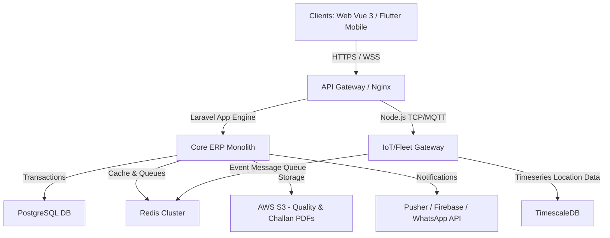
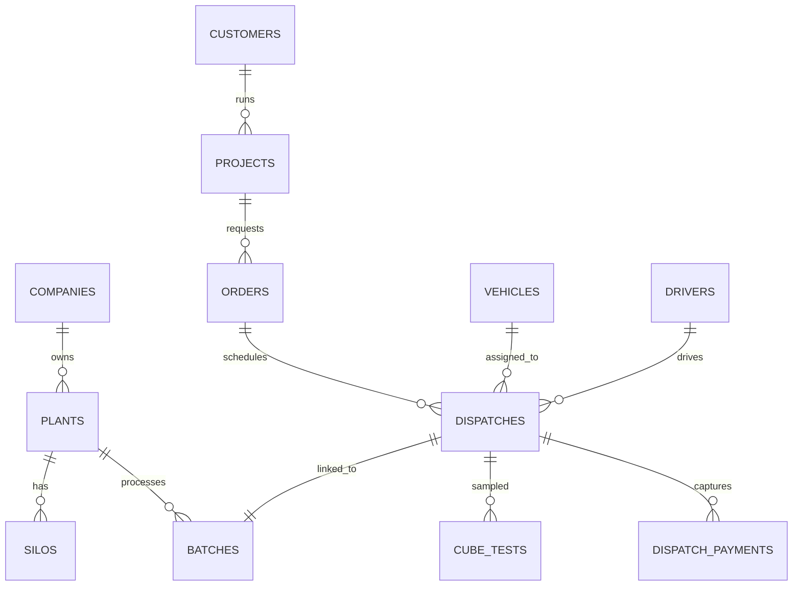

# Ready Mix ERP: Technical Architecture, Database Design & API Documentation

This document describes the software architecture, database design, REST API specifications, and security protocols for **Ready Mix ERP**.

---

## 1. Technical Architecture

### High-Level Architecture Overview
The platform uses a Hybrid Monolith & Microservices architecture. The core ERP (CRM, inventory, billing, HR, maintenance) is built as a Laravel application (reflecting the workspace's structure), while real-time IoT scale ingestion and GPS vehicle tracking are handled by lightweight Node.js/Go-based services optimized for high-throughput TCP socket connection handling.



### 1. Technology Stack
- **Frontend**: Vue 3 with Vite, Pinia (state management), Inertia.js (for routing without SPA overhead), Tailwind CSS, and Google Fonts (Outfit).
- **Backend (Core ERP)**: Laravel 10+, PHP 8.2, Eloquent ORM, Laravel Queue (redis driver) for background jobs.
- **IoT & Telematics Service**: Go (for receiving raw GPS packet bytes over TCP/UDP) and Node.js (for weighbridge serial agent connectivity).
- **Databases**:
  - *Transactional Data*: PostgreSQL 15+ (acid compliance, JSONB support for dynamic mix design configurations).
  - *Fleet Telematics (Time-Series)*: TimescaleDB extension inside PostgreSQL (optimized for fast geo-spatial querying of truck routes).
  - *Caching/Sockets*: Redis (for live GPS coordinate caching and Pub/Sub).
- **Storage**: AWS S3 or MinIO (for storing digital delivery challan signatures, batch load photos, and lab test certificates).
- **Mobile Applications**: Flutter (compiles to native Android and iOS), utilizing SQLite for offline storage and local sync.

### 2. Network & IoT Connectivity
- **Weighbridge Sync**: A lightweight C# / Node.js agent installed on the local weighbridge PC reads raw serial data (RS-232 / COM ports) from indicators (e.g., Avery, Bilanciai). It pushes the stable weight payload to our cloud REST API via HTTPS, signed with a hardware-specific token.
- **Batch Plant SCADA Sync**: A TCP agent connects to the batching plant SCADA database (Access, SQL Server, or Firebird) and pushes batched raw materials (aggregate, cement weight profiles) in real-time.
- **GPS/Drum Telematics**: OBD-II / Hardwired GPS trackers transmit NMEA data packets over TCP/UDP to our Go-based socket server. The data is parsed and cached immediately in Redis before being written to TimescaleDB.

### 3. Scaling & Infrastructure
- **Containerization**: Docker containers managed via Kubernetes (AWS EKS) with Auto-scaling groups.
- **Caching Strategy**: Redis caches active mix designs, client credit statuses, and vehicle locations. Database query caching is implemented using Laravel's Cache facade.
- **CI/CD Pipeline**: GitHub Actions running automated PHPUnit tests, ESLint, and deploying to AWS ECS via terraform scripts.
- **Monitoring & Alerting**: Prometheus and Grafana for resource utilization; Sentry for exception tracing.

### 4. Offline Capability
The Flutter mobile application uses an offline-first sync engine. Drivers can capture customer signatures and site coordinates even without network coverage. The data is queued in local SQLite storage and synced using a background service as soon as internet connection is restored.

---

## 2. Database Design (Entity Relationship & Schemas)

### Entity Relationship Diagram



### Key Database Schemas (SQL DDL)

#### 1. Companies Table
```sql
CREATE TABLE mm_companies (
    id BIGSERIAL PRIMARY KEY,
    name VARCHAR(255) NOT NULL,
    legal_name VARCHAR(255),
    gstin VARCHAR(15) UNIQUE,
    pan VARCHAR(10) UNIQUE,
    registered_address TEXT NOT NULL,
    is_active BOOLEAN DEFAULT TRUE,
    created_at TIMESTAMP WITH TIME ZONE DEFAULT CURRENT_TIMESTAMP,
    updated_at TIMESTAMP WITH TIME ZONE DEFAULT CURRENT_TIMESTAMP
);
CREATE INDEX idx_companies_gstin ON mm_companies(gstin);
```

#### 2. Plants (Batching Plants) Table
```sql
CREATE TABLE mm_plants (
    id BIGSERIAL PRIMARY KEY,
    company_id BIGINT NOT NULL REFERENCES mm_companies(id) ON DELETE CASCADE,
    name VARCHAR(255) NOT NULL,
    location VARCHAR(255) NOT NULL,
    latitude DECIMAL(10, 8),
    longitude DECIMAL(11, 8),
    capacity_m3_per_hr DECIMAL(6, 2) NOT NULL,
    plc_gateway_token VARCHAR(100) UNIQUE,
    is_active BOOLEAN DEFAULT TRUE,
    created_at TIMESTAMP WITH TIME ZONE DEFAULT CURRENT_TIMESTAMP,
    updated_at TIMESTAMP WITH TIME ZONE DEFAULT CURRENT_TIMESTAMP
);
CREATE INDEX idx_plants_company ON mm_plants(company_id);
```

#### 3. Mix Designs Table
```sql
CREATE TABLE mm_mix_designs (
    id BIGSERIAL PRIMARY KEY,
    company_id BIGINT NOT NULL REFERENCES mm_companies(id),
    grade_code VARCHAR(20) NOT NULL, -- e.g., M25, M30, M40
    description VARCHAR(255),
    cement_target_kg DECIMAL(6, 2) NOT NULL,
    fly_ash_target_kg DECIMAL(6, 2) NOT NULL,
    water_target_kg DECIMAL(6, 2) NOT NULL,
    sand_target_kg DECIMAL(6, 2) NOT NULL,
    aggregate_10mm_target_kg DECIMAL(6, 2) NOT NULL,
    aggregate_20mm_target_kg DECIMAL(6, 2) NOT NULL,
    admixture_target_kg DECIMAL(5, 2) NOT NULL,
    approved_by BIGINT,
    is_active BOOLEAN DEFAULT TRUE,
    created_at TIMESTAMP WITH TIME ZONE DEFAULT CURRENT_TIMESTAMP,
    CONSTRAINT unique_company_grade UNIQUE(company_id, grade_code)
);
```

#### 4. Dispatches Table
```sql
CREATE TABLE mm_dispatches (
    id BIGSERIAL PRIMARY KEY,
    plant_id BIGINT NOT NULL REFERENCES mm_plants(id),
    order_id BIGINT NOT NULL,
    vehicle_id BIGINT NOT NULL,
    driver_id BIGINT NOT NULL,
    mix_design_id BIGINT NOT NULL REFERENCES mm_mix_designs(id),
    dispatch_number VARCHAR(50) UNIQUE NOT NULL,
    batch_qty_m3 DECIMAL(4, 2) NOT NULL,
    tare_weight_kg DECIMAL(8, 2),
    gross_weight_kg DECIMAL(8, 2),
    net_weight_kg DECIMAL(8, 2),
    status VARCHAR(30) NOT NULL DEFAULT 'SCHEDULED', -- SCHEDULED, BATCHING, DISPATCHED, ON_SITE, COMPLETED, CANCELLED
    loaded_at TIMESTAMP WITH TIME ZONE,
    left_plant_at TIMESTAMP WITH TIME ZONE,
    arrived_site_at TIMESTAMP WITH TIME ZONE,
    completed_discharge_at TIMESTAMP WITH TIME ZONE,
    created_at TIMESTAMP WITH TIME ZONE DEFAULT CURRENT_TIMESTAMP,
    updated_at TIMESTAMP WITH TIME ZONE DEFAULT CURRENT_TIMESTAMP
);
CREATE INDEX idx_dispatches_status ON mm_dispatches(status);
CREATE INDEX idx_dispatches_dispatch_number ON mm_dispatches(dispatch_number);
```

#### 5. Dispatch Payments Table
```sql
CREATE TABLE mm_dispatch_payments (
    id BIGSERIAL PRIMARY KEY,
    dispatch_id BIGINT NOT NULL REFERENCES mm_dispatches(id) ON DELETE CASCADE,
    payment_method_id BIGINT NOT NULL,
    amount DECIMAL(12, 2) NOT NULL,
    transaction_reference VARCHAR(100),
    payment_status VARCHAR(30) NOT NULL DEFAULT 'PENDING', -- PENDING, COMPLETED, FAILED
    collected_by BIGINT,
    collected_at TIMESTAMP WITH TIME ZONE,
    created_at TIMESTAMP WITH TIME ZONE DEFAULT CURRENT_TIMESTAMP
);
CREATE INDEX idx_dispatch_payments_dispatch ON mm_dispatch_payments(dispatch_id);
```

---

## 3. REST API Documentation

### Authentication (POST `/api/v1/auth/login`)
Clients (Mobile, SCADA Agent, Web) authenticate using bearer tokens.

**Request Payload**:
```json
{
  "email": "dispatcher.pune@modormc.com",
  "password": "SecurePassword123",
  "device_name": "android_tablet_dispatch"
}
```

**Response (200 OK)**:
```json
{
  "status": "success",
  "data": {
    "token": "42|xyz890123456789abcde...",
    "user": {
      "id": 12,
      "name": "Ramesh Kumar",
      "email": "dispatcher.pune@modormc.com",
      "role": "DISPATCH_MANAGER",
      "plant_id": 3
    }
  }
}
```

---

### Weighbridge Weight Sync (POST `/api/v1/weighbridge/sync`)
Pushed by the local weighbridge agent when a truck is weighed.

**Request Header**:
`Authorization: Bearer 42|xyz890...`

**Request Payload**:
```json
{
  "plant_id": 3,
  "weighbridge_id": 1,
  "dispatch_number": "RMC-PL3-26-00452",
  "weight_kg": 24560.00,
  "type": "GROSS", -- TARE or GROSS
  "captured_at": "2026-06-23T11:15:30Z"
}
```

**Response (200 OK)**:
```json
{
  "status": "success",
  "message": "Gross weight synced successfully",
  "data": {
    "dispatch_id": 982,
    "dispatch_number": "RMC-PL3-26-00452",
    "tare_weight_kg": 12500.00,
    "gross_weight_kg": 24560.00,
    "net_weight_kg": 12060.00,
    "calculated_volume_m3": 5.02
  }
}
```

---

### Batch SCADA Sync (POST `/api/v1/batch/production-sync`)
Pushed by the SCADA plant controller immediately after batching a load.

**Request Payload**:
```json
{
  "plc_gateway_token": "pgt_pune_plant_3_schwing",
  "dispatch_number": "RMC-PL3-26-00452",
  "batch_cycle_id": "BC-98311",
  "actuals": {
    "cement_kg": 1780.00,
    "fly_ash_kg": 495.00,
    "water_kg": 890.00,
    "sand_kg": 4410.00,
    "aggregate_10mm_kg": 3200.00,
    "aggregate_20mm_kg": 4820.00,
    "admixture_kg": 23.40
  },
  "moisture_adjustments": {
    "sand_moisture_pct": 4.20,
    "aggregate_moisture_pct": 1.10
  },
  "batched_at": "2026-06-23T11:10:15Z"
}
```

**Response (201 Created)**:
```json
{
  "status": "success",
  "message": "Batch production data logged and inventory adjusted",
  "data": {
    "batch_id": 4810,
    "inventory_deductions": {
      "cement": "1780.00kg",
      "sand": "4410.00kg"
    }
  }
}
```

---

### Delivery Confirmation (POST `/api/v1/delivery/confirm`)
Pushed by the driver app when discharge is completed at the site.

**Request Payload**:
```json
{
  "dispatch_number": "RMC-PL3-26-00452",
  "latitude": 18.520430,
  "longitude": 73.856744,
  "water_added_at_site_liters": 0.00,
  "unloading_start_time": "2026-06-23T11:45:00Z",
  "unloading_end_time": "2026-06-23T12:05:00Z",
  "customer_signature_base64": "iVBORw0KGgoAAAANSUhEUgAAAAEAAAABCAQAAAC1HAwCAAAAC0lEQVR42mNkYAAAAAYAAjCB0C8AAAAASUVORK5CYII=",
  "customer_feedback_rating": 5
}
```

**Response (200 OK)**:
```json
{
  "status": "success",
  "message": "Delivery completed and logged",
  "invoice_url": "https://storage.modormc.com/invoices/2026/INV-009823.pdf"
}
```

---

## 4. Security & Compliance

### 1. Role-Based Access Control (RBAC)
We enforce deep RBAC at both the middleware (Laravel) and database views level. Each API endpoint evaluates the user's token scopes.
- Users cannot perform operations outside their designated `plant_id` unless flagged as a regional administrator or super-admin.
- Financial transactions (deleting dispatches, writing off debt, altering contract rates) require dual-factor authorization (OTP via SMS/WhatsApp) from a Finance Manager.

### 2. Encryption Standards
- **Data in Transit**: Enforced TLS 1.3 across all REST, WebSocket, and TCP packet interfaces.
- **Data at Rest**: AWS RDS storage instances encrypted using AES-256 keys managed by AWS KMS.
- **Sensitive Fields**: Driver PAN/Aadhaar cards, banking account details, and API keys are stored encrypted at the database level using Laravel's built-in `encrypt()` helper (AES-256-CBC).

### 3. Audit Logs
Every database modification is tracked. The `mm_audit_logs` table logs:
- `user_id`, `action` (Create, Update, Delete), `ip_address`, `user_agent`, `table_name`, `record_id`, `before_payload` (JSONB), and `after_payload` (JSONB).
- Audit logs are set to read-only at the database engine level (users are denied UPDATE/DELETE queries on the audit logs table).

### 4. Regulatory Compliance
- **Indian GST Compliance**: Automated JSON compilation matching NIC schema for direct API upload to standard GST portals for **e-Invoicing** and **E-Way Bills**.
- **Data Privacy**: Although GDPR is European, we align with the Indian Digital Personal Data Protection (DPDP) Act 2023:
  - Users can request deletion of personal driver data.
  - Anonymized vehicle telemetry after 90 days.
