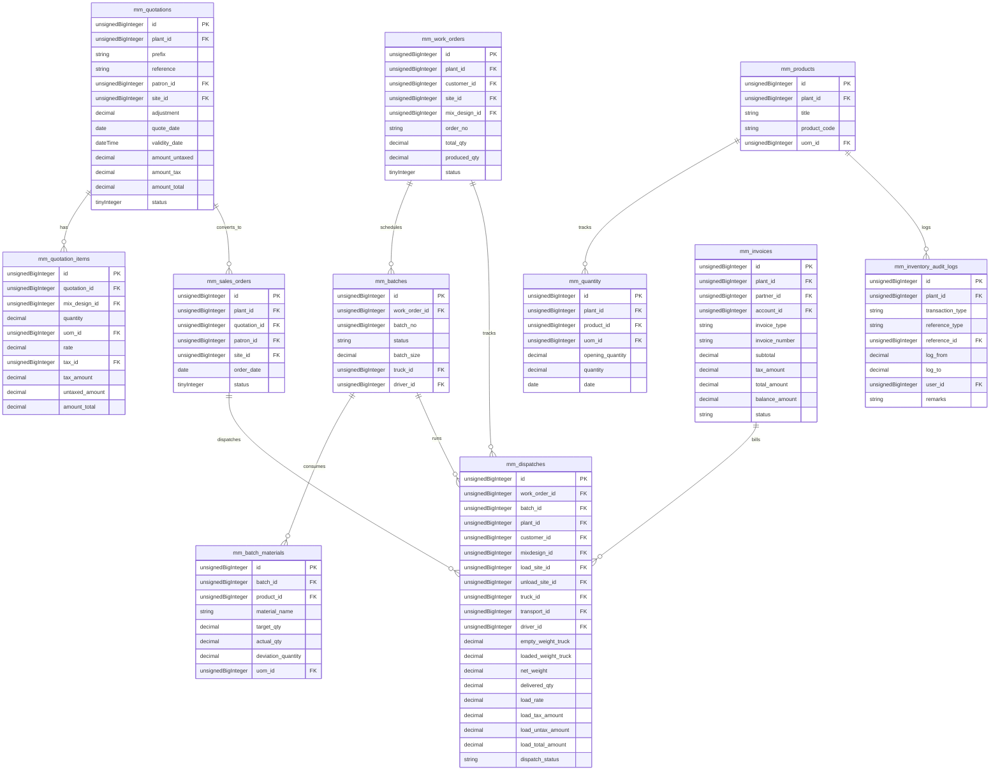
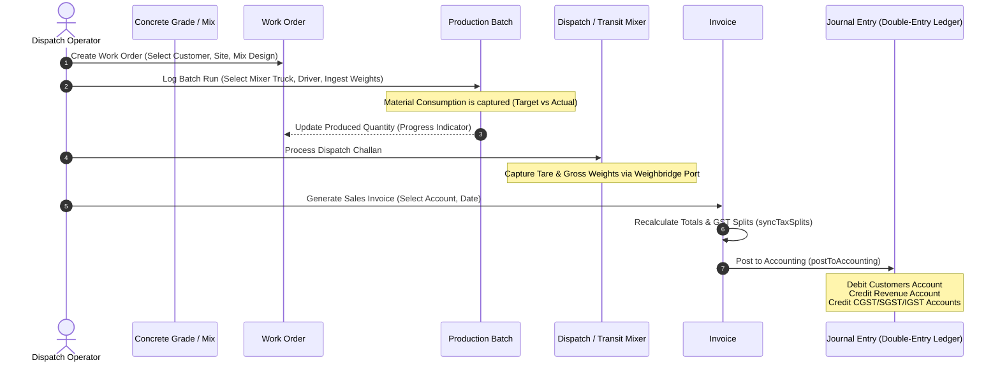

# System Architecture Audit & Technical Documentation
## ERP System for Ready Mix Concrete (RMC) & Manufacturing

This document serves as the golden source of truth for the RMC ERP system, outlining its architecture, database design, modules, business logic, data flow, and frontend-backend synchronization.

---

## 1. Business & Domain Understanding

Ready Mix Concrete (RMC) production is a highly time-sensitive and precision-critical manufacturing operation. The ERP system is custom-built to manage the challenges of the concrete industry:
1. **Perishable Inventory**: Wet concrete has a limited lifespan (typically 2–3 hours from batching to discharge). Delivery scheduling must be synchronized with manufacturing capacity.
2. **Formula Precision**: Different structural requirements necessitate specific **Mix Designs** (e.g., M20, M30, M40 concrete grades) composed of strict ratios of raw materials (cement, aggregates, sand, water, admixtures).
3. **Hardware Ingestion**: Ingesting production batches directly from automated Batching Plant PLCs prevents manual entry discrepancies and tracks real-time material depletion.
4. **Logistics & Weighbridge Operations**: Transit mixers are weighed before (tare weight) and after loading (gross weight) to calculate exact net weights.
5. **Strict Auditing**: Every stock update, pricing override, and transaction status change must be logged for inventory auditing and financial compliance.

---

## 2. Technical Stack & Architectural Overview

The system uses a monolithic architecture with a decoupled frontend interface, utilizing modern design patterns:

*   **Backend**: PHP 8.2+ / Laravel 11 framework.
    *   **Eloquent ORM** for database abstraction and query building.
    *   **Spatie Laravel Permission** for Role-Based Access Control (RBAC).
    *   **Inertia.js** acting as the protocol bridge, eliminating the need for client-side routing or state sync REST APIs.
*   **Frontend**: Vue.js 3 with Composition API.
    *   Responsive, high-density layouts utilizing custom UI components.
    *   **WebSockets** (Laravel Echo / Pusher) for real-time batch production updates.
*   **API & Integration Layer**:
    *   **PLC Integration**: Ingests automated RMC production logs using `/api/production__Order__data` and `/api/production/batch`.
    *   **Weighbridge Serial Port Adapter**: Real-time integration via a local CORS proxy bridge (`http://localhost:8089/api/port`) to capture truck weight directly in Vue components.
    *   **E-Invoice & E-Way Bill**: Custom JSON payload compilers for government tax portals.
    *   **RAG/AI Layer**: Built-in vector embedding integrations for document processing and natural language queries on ERP data.
*   **Auditing Abstraction**:
    *   **General Activities**: Logged automatically via `ModelAuditSubscriber` listener into `mm_activity_log`.
    *   **Model Diffs & Inventory Diffs**: Models using the `TracksModelChanges` trait trigger the `ModelAuditObserver` to record specific field changes in `mm_inventory_audit_logs`.

---

## 3. Database Schema & ERD

The database uses the `PlantScoping` trait to ensure data isolation. Below is the detailed relational structure mapping primary/foreign keys, fields, and types:



---

## 4. Module Breakdown

### 4.1 Quotation & Sales Order Pipeline (Commercial Foundation)
The quotation and sales order workflow handles customer contracts, pricing negotiation, and logistics mapping before raw materials are dispatched.

#### 4.1.1 Quotation Lifecycle (`Quotation` & `QuotationItem`)
*   **Initialization**: Quotations are initialized in the `mm_quotations` table. They link to `mm_patrons` (customers/vendors) and optionally to `mm_sites` (delivery locations).
*   **Drafting Transactions**:
    *   **Atomic Persistence**: Using `Quotation::createWithItems`, the header and its child lines (`mm_quotation_items`) are wrapped in a single database transaction (`DB::transaction`).
    *   **Dynamic Site Creation**: If a new site is specified on the fly (`new_site_name`), the system automatically creates a site record in the `mm_sites` table and associates it with the quotation before persisting.
    *   **Reference Auto-generation**: Generates a standard sequential document reference format `QT-YY-XXXX` (where `YY` is the financial year and `XXXX` is a sequential code reset per plant).
*   **Calculation Details (`updateTotals`)**:
    *   Calculates the sum of item subtotals (`untaxed_amount`) and taxes (`tax_amount`).
    *   Applies any custom adjustments and persists the final total (`amount_total = untaxed + tax + adjustment`).
*   **Statuses & Access Control**:
    *   *Draft (0)*: Editable and deletable.
    *   *Sent (1)*: Dispatched to the customer via email (`sendEmail()`).
    *   *Accepted (2)*: Materialized into a Sales Order. No longer editable or deletable.
    *   *Rejected (3)*: Terminated. No longer editable or deletable.

#### 4.1.2 Sales Order Conversion (`SalesOrder`)
*   **Materialization**: Invoked by `SalesOrderController::store`. When a quotation is accepted, a confirmed Sales Order is logged in `mm_sales_orders` referencing the original `quotation_id`.
*   **Line-Item Resolution**: Instead of copying item records and bloating the database (`mm_sales_order_items`), the system references the quotation line items (`mm_quotation_items`) directly through the quotation model.
*   **Downstream Links**: The resulting `SalesOrder` acts as the contract against which `mm_dispatches` are issued.

### 4.2 Production & PLC Batching
*   **Production Orders (`WorkOrder`)**: Relates to customers, mix designs, and sites. Controls target volume and displays progress indicators.
*   **Production Batches (`Batch`)**: Scheduled under a Work Order. Tracks transit mixer details, drivers, departure times, and tare/gross weights.
*   **Batch Materials (`BatchMaterial`)**: Integrates target vs actual ingredient weights from plant PLC outputs and computes deviations.

### 4.3 Logistics & Weighbridge
*   **Dispatches (`Dispatch`)**: Captures mixer trucks and weights (tare vs gross) via the local weighbridge serial proxy. It exposes accessors (`amount_untaxed`, `amount_tax`, `amount_total`) to support automated invoicing.
*   **GPS Telemetry**: Ingested on `/api/gps/telemetry` to trace coords against geofences.

### 4.4 Financial Accounting
*   **Invoicing (`Invoice`)**: Compiles tax splits (CGST/SGST/IGST) and global discounts.
*   **Journal Entries (`JournalEntry`, `JournalEntryLine`)**: On invoice approval, the double-entry bookkeeping engine (`PostsToAccounting` trait) posts balanced debit and credit entries to the general ledgers.

---

## 5. Data Flow & Transaction Logic

### 5.1 Work Order to Invoicing & Accounting Flow



---

## 6. Detailed Accounting Integration

The `PostsToAccounting` trait governs ledger posting. Below are the double-entry bookkeeping rules implemented on document approval:

### 6.1 Booking Journal Entries
1.  **Header Creation**: Creates a `JournalEntry` voucher categorized as `SALES` or `PURCHASE`, with the invoice number as the voucher reference.
2.  **Partner Booking**:
    *   *Sales Invoice*: **Debits** Customer Ledger (Sundry Debtor) for the total invoice amount.
    *   *Purchase Bill*: **Credits** Vendor Ledger (Sundry Creditor) for the total bill amount.
3.  **Base Income/Expense Booking**:
    *   *Sales Invoice*: **Credits** Revenue Ledger for the untaxed subtotal.
    *   *Purchase Bill*: **Debits** Expense/Asset Ledger for the untaxed subtotal.
4.  **Tax Bookkeeping**:
    *   Line-level tax splits (calculated in `syncTaxSplits()`) are processed.
    *   *Sales Invoice*: **Credits** SGST, CGST, or IGST Output tax accounts.
    *   *Purchase Bill*: **Debits** SGST, CGST, or IGST Input tax accounts.
5.  **Adjustments & Charges**:
    *   Shipping fees, discounts, round-offs, and adjustments post to their respective ledger accounts mapped in settings.
6.  **Debit-Credit Balancing**:
    *   A tolerance threshold of `0.05` is enforced. If debits and credits do not balance, the transaction rollbacks and throws an exception.

---

## 7. Inventory Audit Log & Valuation Engine

Inventory is governed by raw material transactions, manual adjustments, and PLC-logged batch consumptions.

### 7.1 Real-Time Stock Adjustments
When a batch transitions to `dispatched` or `completed`, the `BatchController::adjustStock` method triggers:
*   Subtracts actual material weights used from the `mm_quantity` record.
*   If a batch is deleted or reverted, the materials are added back to stock.
*   Eloquent events on `Quantity` intercept these adjustments and write a log entry to `mm_inventory_audit_logs`.

### 7.2 Inventory Valuation Service (`InventoryValuationService`)
Generates full valuation histories over a date range. It runs an in-memory chronological simulation:
*   **FIFO (First-In, First-Out)**: Tracks stock queues with their original PO inward unit costs, consuming them sequentially to calculate exact cost of goods sold (COGS) and ending valuation.
*   **Weighted Average**: Calculates running average unit costs:
    $$\text{Average Price} = \frac{\text{Current Inventory Value} + \text{Inward Value}}{\text{Current Quantity} + \text{Inward Quantity}}$$
*   **Events Simulated**:
    1.  *Opening Balance*: Loaded from the earliest `Quantity` record.
    2.  *Inwards*: Extracted from `PurchaseOrderHistory` (PO receipts).
    3.  *Consumptions*: Loaded from actual batch material weights (`BatchMaterial`) and manual exhaust adjustments (`StockExhaustLine`).

---

## 8. Frontend Architecture & Context State

The frontend relies on Inertia.js to maintain state without complex REST routing.

### 8.1 Shared Global Props (`HandleInertiaRequests.php`)
Every page transition loads common variables into the Vue application context:
```json
{
  "active_entity": {
    "entity_id": 1,
    "entity_name": "Modo Concrete Ltd",
    "role_name": "Super Administrator"
  },
  "active_plant": {
    "plant_id": 2,
    "plant_name": "South Plant",
    "plant_code": "SP02"
  },
  "user_role": "Super Administrator",
  "user_permissions": [
    "users.create",
    "invoices.edit",
    "work_orders.delete"
  ],
  "menus": {
    "top_nav": [],
    "sidebar_nav": []
  }
}
```

### 8.2 Frontend Authorization (`usePermissions.ts`)
The `usePermissions` composable exposes authorization logic in Vue pages:
```typescript
const { can, isSuperAdmin } = usePermissions();

// Example usage in component template:
// <button v-if="can('invoices.create')">Generate Invoice</button>
```

---

## 9. Integrations & Hardware Bridging

### 9.1 Weighbridge Serial Interface (`useWeighbridgeSerial.ts`)
Interacts with hardware weighbridge indicators over serial communication:
*   Sends polling commands to the local bridge proxy (`localhost:8089/api/port`).
*   Parses incoming ASCII weight strings (extracting integers, handling unit conversions).
*   Allows the operator to capture empty (tare) and loaded (gross) weights with one click.

### 9.2 Compliance Engine (E-Invoice & E-Way Bill)
*   **E-Invoice Generation**: Resolves HSN codes, tax components, customer/vendor GSTINs, and addresses. It posts them to the tax API gateway, returning the IRN, acknowledgment number, and a base64 QR code image.
*   **E-Way Bill Integration**: Gathers transit mixer registrations, driver details, and invoice parameters to generate transport clearance codes.
